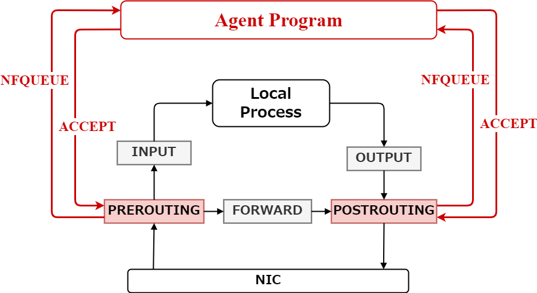

# SRv6 packt tracking netfilter agent


## Usage 

```bash
$  ./collector_agent.py -h
usage: collector_agent.py [-h] [-v] [-f] [--log_file LOG_FILE] [--ip IP] [--port PORT] [--nfqueue_num_pre NFQUEUE_NUM_PRE] [--nfqueue_num_post NFQUEUE_NUM_POST] [-s] [-m MODE] [--node_id NODE_ID] [--node_id_length NODE_ID_LENGTH]
                          [--counter_length COUNTER_LENGTH]

options:
  -h, --help            show this help message and exit
  -v, --verbose
  -f, --force_pktid_setting
  --log_file LOG_FILE   log file path
  --ip IP               server ip address
  --port PORT           listening port
  --nfqueue_num_pre NFQUEUE_NUM_PRE
                        nfqueue number (PREROUTING)
  --nfqueue_num_post NFQUEUE_NUM_POST
                        nfqueue number (POSTROUTING)
  -s, --stand_alone     run stand alone
  -m MODE, --mode MODE  packet or packet_id (only stand alone mode)
  --node_id NODE_ID     node id (only stand alone mode)
  --node_id_length NODE_ID_LENGTH
                        node id length (only stand alone mode)
  --counter_length COUNTER_LENGTH
                        counter length (only stand alone mode)
```

## Architecture


